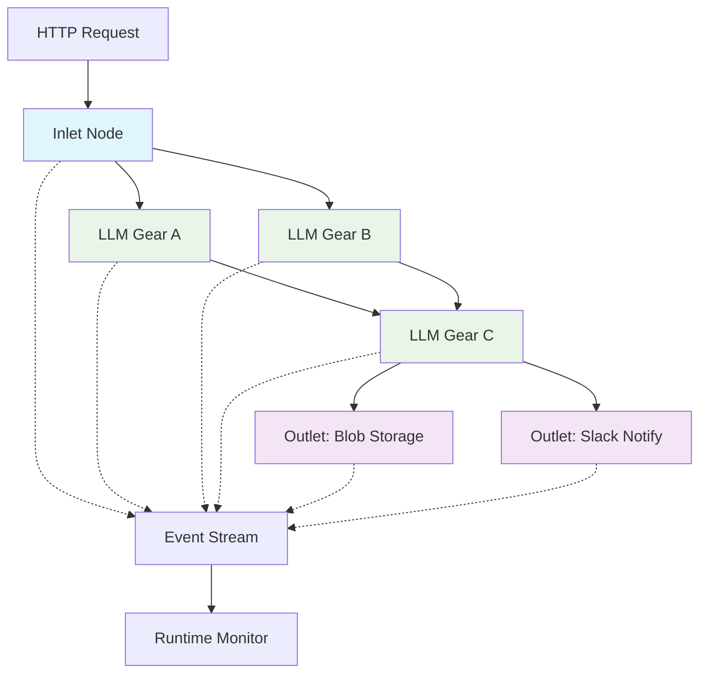

# Patch Runtime Design: Inlets, Outlets & Event Streaming

*Extends the visual graph builder with HTTP entrypoints (Inlets), side-effect actions (Outlets), 
comprehensive runtime data models, and a streaming event system for real-time pipeline execution monitoring.*

## Overview

This design introduces new node types, runtime data models, and a streaming runtime to transform Patch from a 
standalone LLM processing tool into a deployable API service. **Inlet nodes** serve as HTTP 
entrypoints that trigger patch execution, while **Outlet nodes** perform side effects like blob 
storage, Slack notifications, or cache invalidation. The **runtime data models** provide comprehensive 
type safety and validation, while the **streaming event model** provides real-time visibility into 
pipeline execution, enabling live monitoring, debugging, and cost tracking across complex multi-node workflows.

## Motivation & Goals

**Pain points this feature solves:**
- Manual gear triggering requires UI interaction; no programmatic execution
- No way to publish results or trigger external actions from patch completion
- Limited visibility into execution progress for long-running multi-node pipelines
- Difficult to integrate patch workflows with external systems or webhooks
- No cost tracking or performance monitoring for production deployments
- Complex debugging when nodes fail without clear execution traces

**Non-goals:**
- Real-time collaborative editing (already implemented via Firestore)
- Advanced workflow orchestration (conditional branching, loops)
- Multi-tenant isolation (single workspace per deployment)
- GraphQL or complex query interfaces

## Runtime Data Models

The Patch runtime uses a comprehensive type system with TypeScript interfaces and Zod validation schemas 
to ensure type safety at both compile-time and runtime. These models provide the foundation for all 
patch execution, validation, and monitoring.

### Core Data Structures

**GearTemplate** - Reusable template defining a gear's behavior:
```typescript
interface GearTemplate {
  id: string;                              // Unique template identifier
  name: string;                           // Template name
  version: string;                        // Semantic version
  author: string;                         // Template author
  description?: string;                   // Short description
  docsMarkdown?: string;                  // Markdown documentation
  configSchema: Record<string, unknown>; // Configuration schema
  defaultConfig: Record<string, unknown>; // Default configuration
  inputPorts: GearPort[];                 // Input port definitions
  outputPorts: GearPort[];                // Output port definitions
  defaultModel?: string;                  // Default LLM model
  mcpServers?: string[];                  // Allowed MCP server URLs
  testCases?: GearTestCase[];             // Unit test cases
  loggingOptions?: LoggingOptions;        // Logging configuration
}
```

**GearInstance** - Instance of a template within a patch:
```typescript
interface GearInstance {
  id: string;                              // Unique instance identifier
  templateId: string;                      // Reference to template
  name?: string;                          // Optional custom name
  config?: Record<string, unknown>;       // Configuration overrides
  loggingOptions?: LoggingOptions;         // Instance logging settings
}
```

**Patch** - Complete patch definition with instances and connections:
```typescript
interface Patch {
  id: string;                   // Patch identifier
  name: string;                 // Patch name
  description?: string;         // Optional description
  nodes: GearInstance[];        // Gear instances
  edges: PatchEdge[];          // Directed connections
  inletIds: string[];          // Inlet node identifiers
  outletIds: string[];         // Outlet node identifiers
  loggingOptions?: LoggingOptions; // Patch-level logging
  runHistory?: PatchRun[];     // Execution history
}
```

**PatchRun** - Execution record with metrics:
```typescript
interface PatchRun {
  status: 'running' | 'succeeded' | 'failed'; // Execution status
  startedAt: number;                          // Start timestamp
  duration: number;                           // Duration in milliseconds
  costSummary?: {                            // Cost tracking
    totalTokens?: number;
    promptTokens?: number;
    completionTokens?: number;
    totalCost?: number;
    currency?: string;
  };
}
```

### Validation & Type Safety

**Dual Validation Approach:**
- **Compile-time**: TypeScript interfaces provide static type checking
- **Runtime**: Zod schemas validate data at runtime with detailed error reporting

**Validation Utilities:**
```typescript
// Type guard validators
function validatePatch(patch: unknown): patch is Patch;
function validateGearTemplate(template: unknown): template is GearTemplate;
function validateGearInstance(instance: unknown): instance is GearInstance;

// Parse functions with error handling
function parsePatch(data: unknown): 
  { success: true; data: Patch } | { success: false; errors: ZodError };
function parseGearTemplate(data: unknown): 
  { success: true; data: GearTemplate } | { success: false; errors: ZodError };
```

**Security Benefits:**
- Prevents malformed data injection
- Validates configuration schemas before execution
- Ensures type consistency across the runtime
- Provides structured error reporting for debugging

## Architecture Diagram



## Node Specifications

### Inlet Node

**TypeScript Interface:**
```typescript
interface InletNode extends PatchNode {
  type: 'inlet';
  config: {
    path: string;          // "/api/webhook/analyze"
    method: 'GET' | 'POST' | 'PUT';
    auth?: {
      type: 'hmac' | 'bearer' | 'none';
      secret?: string;     // For HMAC validation
    };
    rateLimit?: {
      requests: number;    // Max requests per window
      window: number;      // Window in seconds
    };
    cors?: {
      origin: string[];
      methods: string[];
    };
  };
  schema?: JSONSchema7;     // Input validation schema
}
```

**Lifecycle:**
1. HTTP request hits `app/api/inlet/[id]/route.ts`
2. Validates authentication, rate limits, and input schema
3. Triggers patch execution via `runPatch(patchId, inletData)`
4. Returns streaming response with execution events
5. Completes when all connected outlet nodes finish

**HTTP/SSE Details:**
- **Content-Type**: `application/json` for data, `text/event-stream` for streaming
- **Response Format**: Server-Sent Events with execution progress
- **Error Handling**: HTTP status codes + structured error objects

### Outlet Node

**Base Interface:**
```typescript
interface OutletNode extends PatchNode {
  type: 'outlet';
  variant: 'blob' | 'slack' | 'revalidate' | 'webhook' | 'email';
  config: OutletConfig;
  inputMapping?: Record<string, string>; // Map gear outputs to outlet inputs
}
```

**Blob Storage Outlet:**
```typescript
interface BlobOutletConfig {
  bucket: string;           // "user-uploads"
  path: string;            // "reports/{timestamp}.json"
  contentType?: string;    // Default: "application/json"
  metadata?: Record<string, unknown>;
}
```

**Slack Notification Outlet:**
```typescript
interface SlackOutletConfig {
  webhook: string;         // Slack webhook URL
  channel?: string;        // Override default channel
  template: string;        // Message template with {{variable}} substitution
  attachments?: boolean;   // Include gear outputs as attachments
}
```

**Path Revalidation Outlet:**
```typescript
interface RevalidateOutletConfig {
  paths: string[];         // ["/api/data", "/dashboard"]
  tags?: string[];         // Cache tags to invalidate
}
```

## Runtime Event Model

The streaming runtime provides real-time events during patch execution. Events are emitted as Server-Sent Events (SSE) 
for live monitoring and debugging.

**✅ Implemented Event Types:**

```typescript
export type PatchEvent =
  | { type: 'RunStart'; runId: string; ts: number }
  | { type: 'NodeStart'; nodeId: string; ts: number; input: unknown }
  | { type: 'NodeSuccess'; nodeId: string; ts: number; output: unknown }
  | { type: 'NodeError'; nodeId: string; ts: number; error: { message: string; stack?: string } }
  | { type: 'RunComplete'; runId: string; ts: number };
```

**Event Flow:**
1. **RunStart**: Patch execution begins with unique run ID
2. **NodeStart**: Each node begins execution (includes input data)
3. **NodeSuccess/NodeError**: Node completes with output or error
4. **RunComplete**: Entire patch execution finishes

**Future Event Extensions (Planned):**
```typescript
// Future: Token-by-token streaming for LLM nodes
interface TokenEvent {
  type: 'token';
  nodeId: string;
  token: string;
  isComplete: boolean;
}

// Future: Enhanced cost tracking
interface NodeSuccessEvent {
  type: 'NodeSuccess';
  nodeId: string;
  ts: number;
  output: unknown;
  tokenUsage?: {
    promptTokens: number;
    completionTokens: number;
    totalCost: number;
    model: string;
  };
}
```

**✅ Implemented Async Generator:**
```typescript
export async function* runPatch(
  patch: PatchDefinition,
  initialInput: unknown
): AsyncGenerator<PatchEvent> {
  const runId = randomUUID();
  yield { type: 'RunStart', runId, ts: Date.now() };

  // Topological sort for proper execution order
  const order = topoSort(patch.nodes.map(n => n.id), patch.edges);
  const outputs = new Map<string, unknown>();

  for (const nodeId of order) {
    const node = nodeMap.get(nodeId)!;
    const input = determineNodeInput(nodeId, patch.edges, outputs, initialInput);
    
    yield { type: 'NodeStart', nodeId, ts: Date.now(), input };
    
    try {
      const output = await executeNode(node, input);
      outputs.set(nodeId, output);
      yield { type: 'NodeSuccess', nodeId, ts: Date.now(), output };
    } catch (err) {
      const error = { message: err.message, stack: err.stack };
      yield { type: 'NodeError', nodeId, ts: Date.now(), error };
      yield { type: 'RunComplete', runId, ts: Date.now() };
      return;
    }
  }

  yield { type: 'RunComplete', runId, ts: Date.now() };
}
```

**✅ Implemented Consumer Pattern (SSE Streaming):**
```typescript
// Server-Sent Events streaming to client
function generatorToStream<T>(gen: AsyncGenerator<T>) {
  return new ReadableStream({
    async pull(controller) {
      const { value, done } = await gen.next();
      if (done) {
        controller.close();
        return;
      }
      controller.enqueue(`data: ${JSON.stringify(value)}\n\n`);
    }
  });
}

// Usage in API route
const stream = generatorToStream(runPatch(patch, payload));
return new Response(stream, {
  headers: { 'Content-Type': 'text/event-stream' }
});
```

## API Surface

**✅ Implemented Route Handlers:**

```typescript
// apps/web/app/api/inlet/[id]/route.ts - IMPLEMENTED
export async function POST(
  req: Request,
  { params }: { params: { id: string } }
) {
  // Input validation
  if (!params.id || typeof params.id !== 'string' || params.id.trim() === '') {
    return new Response('Invalid patch ID', { status: 400 });
  }

  // Parse JSON payload
  let payload: unknown;
  try {
    payload = await req.json();
  } catch (err) {
    return new Response('Invalid JSON payload', { status: 400 });
  }

  // Load patch and create streaming response
  try {
    const patch = await loadPatch(params.id); // TODO: Database integration
    const gen = runPatch(patch, payload);
    const stream = generatorToStream(gen);
    
    return new Response(stream, {
      headers: { 'Content-Type': 'text/event-stream' }
    });
  } catch (err) {
    // Return error stream
    const errorStream = createErrorStream(err);
    return new Response(errorStream, {
      headers: { 'Content-Type': 'text/event-stream' }
    });
  }
}
```

**🚧 Outlet Route (Planned):**
```typescript
// app/api/outlet/[id]/route.ts - PLANNED
export async function POST(request: Request, { params }: { params: { id: string } }) {
  const { id } = params;
  const { data } = await request.json();
  
  const outletNode = await getOutletNode(id);
  return await executeOutlet(outletNode, data);
}
```

**✅ Implemented Helper Libraries:**

```typescript
// packages/runtime/runPatch.ts - IMPLEMENTED
export async function* runPatch(
  patch: PatchDefinition,
  initialInput: unknown
): AsyncGenerator<PatchEvent> {
  // Streaming patch execution with events
  // Includes topological sorting, security validation, error handling
}

// packages/runtime/security.ts - IMPLEMENTED
export function validateHttpUrl(url: string): void;
export function createTimeoutController(timeoutMs: number): AbortController;

// packages/runtime/topoSort.ts - IMPLEMENTED  
export function topoSort(nodeIds: string[], edges: PatchEdge[]): string[];

// packages/runtime/localFns.ts - IMPLEMENTED
export const localFns: Record<string, (input: unknown) => Promise<unknown>>;
```

**✅ Implemented Outlet Helpers:**

```typescript
// packages/outlets/blob.ts - IMPLEMENTED
export async function uploadBlob(opts: {
  bucket?: string;
  path: string;
  content: string;
  contentType?: string;
}): Promise<{ url: string; size: number }> {
  // Vercel Blob integration with error handling
  const result = await put(opts.path, opts.content, {
    access: 'public',
    contentType: opts.contentType || 'text/plain'
  });
  return { url: result.url, size: new Blob([opts.content]).size };
}

// packages/outlets/revalidate.ts - IMPLEMENTED
export async function revalidate(paths: string[] | string): Promise<void> {
  // Next.js cache revalidation with error handling
  const pathsArray = Array.isArray(paths) ? paths : [paths];
  pathsArray.forEach(path => revalidatePath(path));
}
```

## Implementation Status

**✅ Completed Components:**
- **Runtime Engine**: Streaming patch execution with topological sorting
- **Event System**: Server-Sent Events for real-time monitoring  
- **Security Layer**: URL validation and timeout controls for HTTP nodes
- **Inlet API**: HTTP endpoint for triggering patch execution
- **Outlet Helpers**: Blob storage and cache revalidation utilities
- **Data Models**: Comprehensive TypeScript interfaces with Zod validation
- **Type Safety**: Runtime validation with structured error reporting

**🚧 In Progress:**
- **Database Integration**: Replace mock patch loading with Firestore integration
- **Authentication**: HMAC and bearer token validation for inlet endpoints
- **Rate Limiting**: Per-inlet request throttling and abuse prevention

**📋 Planned Features:**
- **Outlet Routes**: HTTP endpoints for side-effect execution
- **Visual Components**: ReactFlow nodes for inlet/outlet types
- **Advanced Workflow**: Conditional routing and sub-patch composition
- **Token Streaming**: Real-time LLM token emission
- **MCP Integration**: Model Context Protocol server support

**Database Schema (Planned Updates):**
- Extend `PatchNode` with `type: 'gear' | 'inlet' | 'outlet'` field
- Add inlet/outlet configuration storage
- Implement patch template and instance separation
- Update Firestore security rules for new node types

**ReactFlow Integration (Planned):**
- Multi-type node registry supporting gear/inlet/outlet nodes
- Visual components for inlet and outlet node configuration
- Connection validation for cross-node-type edges
- Drag-and-drop palette with all node types

## Security & Rate-limiting

**✅ Implemented Security Measures:**

```typescript
// packages/runtime/security.ts - IMPLEMENTED
export function validateHttpUrl(url: string): void {
  // SSRF protection - validates URLs against allowlists
  // Blocks private IP ranges, localhost, and suspicious protocols
}

export function createTimeoutController(timeoutMs: number): AbortController {
  // Request timeout protection (default 30 seconds)
  // Prevents hanging requests and resource exhaustion
}
```

**✅ Current Security Features:**
- **SSRF Protection**: HTTP nodes validate URLs against private IP ranges
- **Request Timeouts**: Automatic timeout for HTTP nodes (30s default)
- **Input Validation**: JSON payload validation with error handling
- **Error Sanitization**: Structured error responses without sensitive data

**🚧 Planned Security Enhancements:**

```typescript
// Planned: HMAC Authentication
export function validateHMACSignature(
  payload: string,
  signature: string,
  secret: string
): boolean {
  const expected = crypto
    .createHmac('sha256', secret)
    .update(payload)
    .digest('hex');
  return crypto.timingSafeEqual(Buffer.from(signature), Buffer.from(expected));
}

// Planned: Rate Limiting
interface RateLimitConfig {
  requests: number;    // Max requests per window
  window: number;      // Window in seconds  
  strategy: 'sliding' | 'fixed';
}
```

**Security Considerations:**
- **Outlet webhooks**: Will require explicit URL allowlists
- **Inlet authentication**: HMAC/bearer tokens required for production
- **Environment secrets**: No hardcoded credentials in configuration
- **Schema validation**: Prevents malformed data injection attacks

## Performance & Cost

**Streaming vs Buffering:**
- **Streaming Mode**: Real-time events, higher memory efficiency, better UX
- **Buffered Mode**: Lower latency for simple patches, easier error recovery
- Automatic mode selection based on patch complexity and client capabilities

**✅ Implemented Cost Tracking (Runtime Data Models):**
```typescript
// From packages/runtime/models.ts  
interface PatchRun {
  status: 'running' | 'succeeded' | 'failed';
  startedAt: number;
  duration: number;
  costSummary?: {
    totalTokens?: number;
    promptTokens?: number;  
    completionTokens?: number;
    totalCost?: number;
    currency?: string;
  };
}
```

**Future Token Cost Tracking:**
```typescript
// Planned: Enhanced cost tracking per node
interface NodeTokenUsage {
  model: string;           // "gpt-4o", "claude-3-sonnet"
  promptTokens: number;
  completionTokens: number;
  totalTokens: number;
  estimatedCost: number;   // USD based on current pricing
}

interface DetailedRunCostSummary extends PatchRun {
  nodeBreakdown: Record<string, NodeTokenUsage>;
  totalDuration: number;
}
```

**✅ Implemented Performance Features:**
- **Topological Sorting**: Ensures correct execution order based on dependencies
- **Security Validation**: SSRF protection with minimal performance impact  
- **Timeout Controls**: Prevents resource exhaustion from hanging requests
- **Streaming Events**: Memory-efficient real-time monitoring
- **Error Handling**: Fast-fail execution stops on first node error

**Planned Performance Optimizations:**
- Parallel node execution where dependencies allow
- Connection pooling for outlet HTTP requests  
- Gear output caching for repeated inputs
- Database batch operations for log updates

## Current Node Types

**✅ Implemented Node Types:**

```typescript
// types/Node.ts - Current implementation
export interface HttpNode {
  id: string;
  kind: 'http';
  url: string;  // SSRF-validated HTTP endpoint
}

export interface LocalNode {
  id: string;
  kind: 'local';
  fn: string;   // Function name from localFns registry
}

export type Node = HttpNode | LocalNode;
```

**Node Execution:**
- **HTTP Nodes**: Make POST requests to external APIs with timeout protection
- **Local Nodes**: Execute registered functions from the `localFns` registry
- **Security**: All HTTP URLs validated against SSRF attacks
- **Error Handling**: Structured error responses with optional stack traces

**Future Node Types (Planned):**
- **LLM Nodes**: Direct integration with OpenAI, Anthropic, etc.
- **Inlet Nodes**: HTTP entrypoints that trigger patch execution
- **Outlet Nodes**: Side-effect actions (blob storage, notifications, etc.)
- **MCP Nodes**: Integration with Model Context Protocol servers

## Future Extensions

**MCP Server Support:**
```typescript
// Future: MCP tool integration within gears
interface MCPGearConfig {
  mcpServer: string;       // "filesystem://local" 
  tools: string[];         // ["read_file", "write_file"]
  timeout: number;         // Tool execution timeout
}
```

**AI Gateway Provider Swap:**
- Abstract LLM provider interface allowing runtime provider switching
- Cost optimization through provider routing (cheapest for simple tasks)
- Fallback chains for reliability (OpenAI → Anthropic → local model)

**Tool-calling in Nodes:**
```typescript
// Future: Native tool support in gear processing
interface ToolCall {
  name: string;
  arguments: Record<string, unknown>;
  result?: unknown;
}

// Enhanced message types for tool interactions
interface ToolCallMessage extends AnyMessagePart {
  type: 'tool-call';
  toolCall: ToolCall;
}
```

**Advanced Workflow Features:**
- Conditional routing based on gear outputs
- Loop constructs for iterative processing  
- Sub-patch composition for modularity
- Scheduled execution triggers (cron-like)
- Integration with external workflow engines (Temporal, etc.)