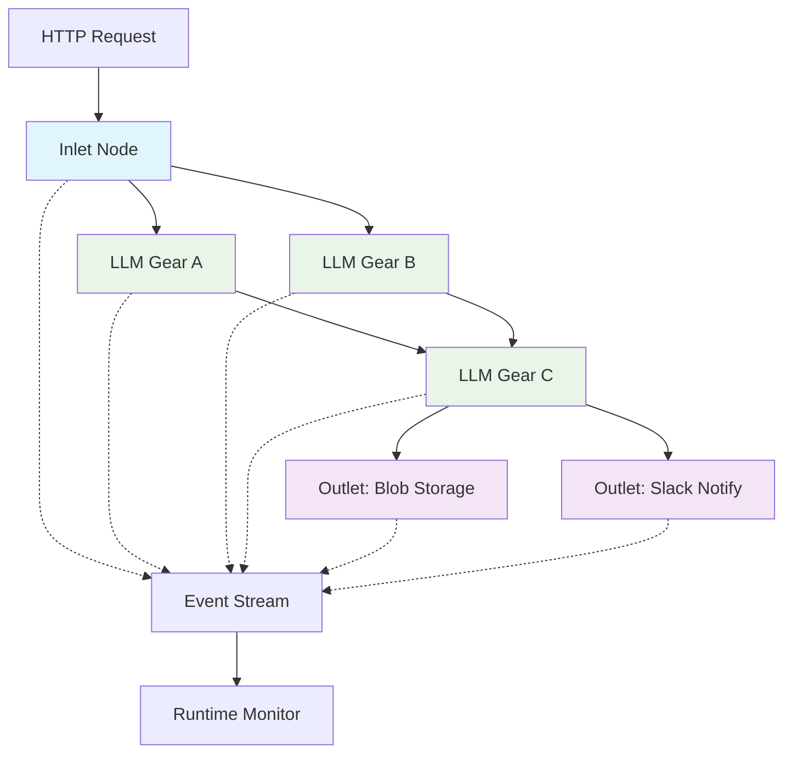

# Patch Runtime Design: Inlets, Outlets & Event Streaming

*Extends the visual graph builder with HTTP entrypoints (Inlets), side-effect actions (Outlets), 
and a comprehensive streaming event system for real-time pipeline execution monitoring.*

## Overview

This design introduces two new node types and a streaming runtime to transform Patch from a 
standalone LLM processing tool into a deployable API service. **Inlet nodes** serve as HTTP 
entrypoints that trigger patch execution, while **Outlet nodes** perform side effects like blob 
storage, Slack notifications, or cache invalidation. The new **streaming event model** provides 
real-time visibility into pipeline execution, enabling live monitoring, debugging, and cost 
tracking across complex multi-node workflows.

## Motivation & Goals

**Pain points this feature solves:**
- Manual gear triggering requires UI interaction; no programmatic execution
- No way to publish results or trigger external actions from patch completion
- Limited visibility into execution progress for long-running multi-node pipelines
- Difficult to integrate patch workflows with external systems or webhooks
- No cost tracking or performance monitoring for production deployments
- Complex debugging when nodes fail without clear execution traces

**Non-goals:**
- Real-time collaborative editing (already implemented via Firestore)
- Advanced workflow orchestration (conditional branching, loops)
- Multi-tenant isolation (single workspace per deployment)
- GraphQL or complex query interfaces

## Architecture Diagram



## Node Specifications

### Inlet Node

**TypeScript Interface:**
```typescript
interface InletNode extends PatchNode {
  type: 'inlet';
  config: {
    path: string;          // "/api/webhook/analyze"
    method: 'GET' | 'POST' | 'PUT';
    auth?: {
      type: 'hmac' | 'bearer' | 'none';
      secret?: string;     // For HMAC validation
    };
    rateLimit?: {
      requests: number;    // Max requests per window
      window: number;      // Window in seconds
    };
    cors?: {
      origin: string[];
      methods: string[];
    };
  };
  schema?: JSONSchema7;     // Input validation schema
}
```

**Lifecycle:**
1. HTTP request hits `app/api/inlet/[id]/route.ts`
2. Validates authentication, rate limits, and input schema
3. Triggers patch execution via `runPatch(patchId, inletData)`
4. Returns streaming response with execution events
5. Completes when all connected outlet nodes finish

**HTTP/SSE Details:**
- **Content-Type**: `application/json` for data, `text/event-stream` for streaming
- **Response Format**: Server-Sent Events with execution progress
- **Error Handling**: HTTP status codes + structured error objects

### Outlet Node

**Base Interface:**
```typescript
interface OutletNode extends PatchNode {
  type: 'outlet';
  variant: 'blob' | 'slack' | 'revalidate' | 'webhook' | 'email';
  config: OutletConfig;
  inputMapping?: Record<string, string>; // Map gear outputs to outlet inputs
}
```

**Blob Storage Outlet:**
```typescript
interface BlobOutletConfig {
  bucket: string;           // "user-uploads"
  path: string;            // "reports/{timestamp}.json"
  contentType?: string;    // Default: "application/json"
  metadata?: Record<string, unknown>;
}
```

**Slack Notification Outlet:**
```typescript
interface SlackOutletConfig {
  webhook: string;         // Slack webhook URL
  channel?: string;        // Override default channel
  template: string;        // Message template with {{variable}} substitution
  attachments?: boolean;   // Include gear outputs as attachments
}
```

**Path Revalidation Outlet:**
```typescript
interface RevalidateOutletConfig {
  paths: string[];         // ["/api/data", "/dashboard"]
  tags?: string[];         // Cache tags to invalidate
}
```

## Runtime Event Model

**Event Types & Payloads:**

```typescript
// Base event structure
interface ExecutionEvent {
  id: string;
  timestamp: number;
  patchId: string;
  runId: string;
}

interface RunStartEvent extends ExecutionEvent {
  type: 'run:start';
  payload: {
    trigger: 'inlet' | 'manual';
    triggerData?: unknown;
    nodeCount: number;
  };
}

interface NodeStartEvent extends ExecutionEvent {
  type: 'node:start';
  payload: {
    nodeId: string;
    nodeType: 'gear' | 'inlet' | 'outlet';
    input?: unknown;
  };
}

interface NodeSuccessEvent extends ExecutionEvent {
  type: 'node:success';
  payload: {
    nodeId: string;
    output?: unknown;
    duration: number;      // milliseconds
    tokenUsage?: {
      prompt: number;
      completion: number;
      cost: number;        // USD
    };
  };
}

interface NodeErrorEvent extends ExecutionEvent {
  type: 'node:error';
  payload: {
    nodeId: string;
    error: {
      message: string;
      code?: string;
      stack?: string;
    };
    retryable: boolean;
  };
}

interface TokenEvent extends ExecutionEvent {
  type: 'token';
  payload: {
    nodeId: string;
    token: string;
    tokenIndex: number;
    isComplete: boolean;
  };
}

interface RunCompleteEvent extends ExecutionEvent {
  type: 'run:complete';
  payload: {
    status: 'success' | 'error' | 'partial';
    duration: number;
    totalTokens: number;
    totalCost: number;
    outputCount: number;
  };
}

type PatchExecutionEvent = RunStartEvent | NodeStartEvent | NodeSuccessEvent | 
                          NodeErrorEvent | TokenEvent | RunCompleteEvent;
```

**Async Generator Pattern:**
```typescript
async function* runPatchWithEvents(
  patchId: string, 
  input: unknown
): AsyncGenerator<PatchExecutionEvent> {
  const runId = generateId();
  
  yield { type: 'run:start', id: generateId(), timestamp: Date.now(), 
          patchId, runId, payload: { trigger: 'inlet', nodeCount: 5 } };
  
  try {
    // TODO: Implement parallel node execution with topological sort
    for (const node of executionOrder) {
      yield* executeNode(node, runId);
    }
    
    yield { type: 'run:complete', id: generateId(), timestamp: Date.now(),
            patchId, runId, payload: { status: 'success', duration: 1200 } };
  } catch (error) {
    yield { type: 'run:complete', id: generateId(), timestamp: Date.now(),
            patchId, runId, payload: { status: 'error', duration: 800 } };
  }
}
```

**Consumer Pattern:**
```typescript
// Real-time monitoring
for await (const event of runPatchWithEvents(patchId, input)) {
  switch (event.type) {
    case 'token':
      streamToClient(event.payload.token);
      break;
    case 'node:error':
      logger.error(`Node ${event.payload.nodeId} failed`, event.payload.error);
      break;
    case 'run:complete':
      updateMetrics(event.payload);
      break;
  }
}
```

## API Surface

**Route Handlers:**

```typescript
// app/api/inlet/[id]/route.ts
export async function POST(
  request: Request,
  { params }: { params: { id: string } }
) {
  const { id } = params;
  
  // TODO: Implement inlet node lookup from database
  const inletNode = await getInletNode(id);
  if (!inletNode) return new Response('Inlet not found', { status: 404 });
  
  // TODO: Add authentication and rate limiting
  await validateInletRequest(request, inletNode.config);
  
  const input = await request.json();
  
  return new Response(
    new ReadableStream({
      async start(controller) {
        for await (const event of runPatchWithEvents(inletNode.patchId, input)) {
          controller.enqueue(`data: ${JSON.stringify(event)}\n\n`);
        }
        controller.close();
      }
    }),
    {
      headers: {
        'Content-Type': 'text/event-stream',
        'Cache-Control': 'no-cache',
        'Connection': 'keep-alive',
      },
    }
  );
}

// app/api/outlet/[id]/route.ts  
export async function POST(
  request: Request,
  { params }: { params: { id: string } }
) {
  const { id } = params;
  const { data } = await request.json();
  
  // TODO: Implement outlet node lookup and execution
  const outletNode = await getOutletNode(id);
  return await executeOutlet(outletNode, data);
}
```

**Helper Libraries:**

```typescript
// lib/runtime/patch-runner.ts
export async function runPatch(
  patchId: string, 
  input: unknown,
  options: { streaming?: boolean } = {}
): Promise<unknown> {
  // TODO: Implement patch execution engine
  const patch = await getPatch(patchId);
  const executionPlan = createExecutionPlan(patch);
  
  if (options.streaming) {
    return runPatchWithEvents(patchId, input);
  }
  
  return await executeSequentially(executionPlan, input);
}

// lib/outlets/blob-storage.ts
export async function publishToBlob(
  config: BlobOutletConfig,
  data: unknown
): Promise<{ url: string; size: number }> {
  // TODO: Implement blob storage integration
  const blob = new Blob([JSON.stringify(data)], { 
    type: config.contentType || 'application/json' 
  });
  
  // Upload to configured storage provider
  const url = await uploadBlob(config.bucket, config.path, blob);
  return { url, size: blob.size };
}
```

## Backward Compatibility & Migration

**Existing Patch Loading:**
- Current gear-only patches load normally; no breaking changes to `Gear` or `Patch` classes
- New `nodeType` field defaults to `'gear'` for existing nodes
- ReactFlow component registry extended with new node renderers

**Default Fallbacks:**
```typescript
// Migration utility for existing patches
export function migratePatchToV2(patch: Patch): Patch {
  return {
    ...patch,
    nodes: patch.nodes.map(node => ({
      ...node,
      type: node.type || 'gear',  // Default to gear for existing nodes
    })),
    version: 2,
  };
}
```

**Database Schema Evolution:**
- Add optional `inlets` and `outlets` arrays to `Patch` documents
- Existing documents continue working; new fields populate on first edit
- Firestore rules updated to allow new node types

## Security & Rate-limiting

**HMAC Authentication:**
```typescript
// lib/auth/hmac.ts
export function validateHMACSignature(
  payload: string,
  signature: string,
  secret: string
): boolean {
  const expected = crypto
    .createHmac('sha256', secret)
    .update(payload)
    .digest('hex');
  return crypto.timingSafeEqual(Buffer.from(signature), Buffer.from(expected));
}
```

**Rate Limiting:**
- Redis-backed sliding window counters per inlet endpoint
- IP-based and API key-based limits
- Configurable per-inlet rate limits with burst allowance

**Security Considerations:**
- Outlet webhooks require explicit URL allowlists
- Inlet authentication required for production deployments  
- Environment-based secrets management (no hardcoded credentials)
- Input validation against JSON schemas prevents injection attacks

## Performance & Cost

**Streaming vs Buffering:**
- **Streaming Mode**: Real-time events, higher memory efficiency, better UX
- **Buffered Mode**: Lower latency for simple patches, easier error recovery
- Automatic mode selection based on patch complexity and client capabilities

**Token Cost Tracking:**
```typescript
interface TokenUsage {
  model: string;           // "gpt-4o", "claude-3-sonnet"
  promptTokens: number;
  completionTokens: number;
  totalTokens: number;
  estimatedCost: number;   // USD based on current pricing
}

// Aggregate usage per patch run
interface RunCostSummary {
  runId: string;
  totalCost: number;
  nodeBreakdown: Record<string, TokenUsage>;
  duration: number;
}
```

**Performance Optimizations:**
- Parallel node execution where dependencies allow
- Connection pooling for outlet HTTP requests
- Gear output caching for repeated inputs
- Database batch operations for log updates

## Future Extensions

**MCP Server Support:**
```typescript
// Future: MCP tool integration within gears
interface MCPGearConfig {
  mcpServer: string;       // "filesystem://local" 
  tools: string[];         // ["read_file", "write_file"]
  timeout: number;         // Tool execution timeout
}
```

**AI Gateway Provider Swap:**
- Abstract LLM provider interface allowing runtime provider switching
- Cost optimization through provider routing (cheapest for simple tasks)
- Fallback chains for reliability (OpenAI → Anthropic → local model)

**Tool-calling in Nodes:**
```typescript
// Future: Native tool support in gear processing
interface ToolCall {
  name: string;
  arguments: Record<string, unknown>;
  result?: unknown;
}

// Enhanced message types for tool interactions
interface ToolCallMessage extends AnyMessagePart {
  type: 'tool-call';
  toolCall: ToolCall;
}
```

**Advanced Workflow Features:**
- Conditional routing based on gear outputs
- Loop constructs for iterative processing  
- Sub-patch composition for modularity
- Scheduled execution triggers (cron-like)
- Integration with external workflow engines (Temporal, etc.)